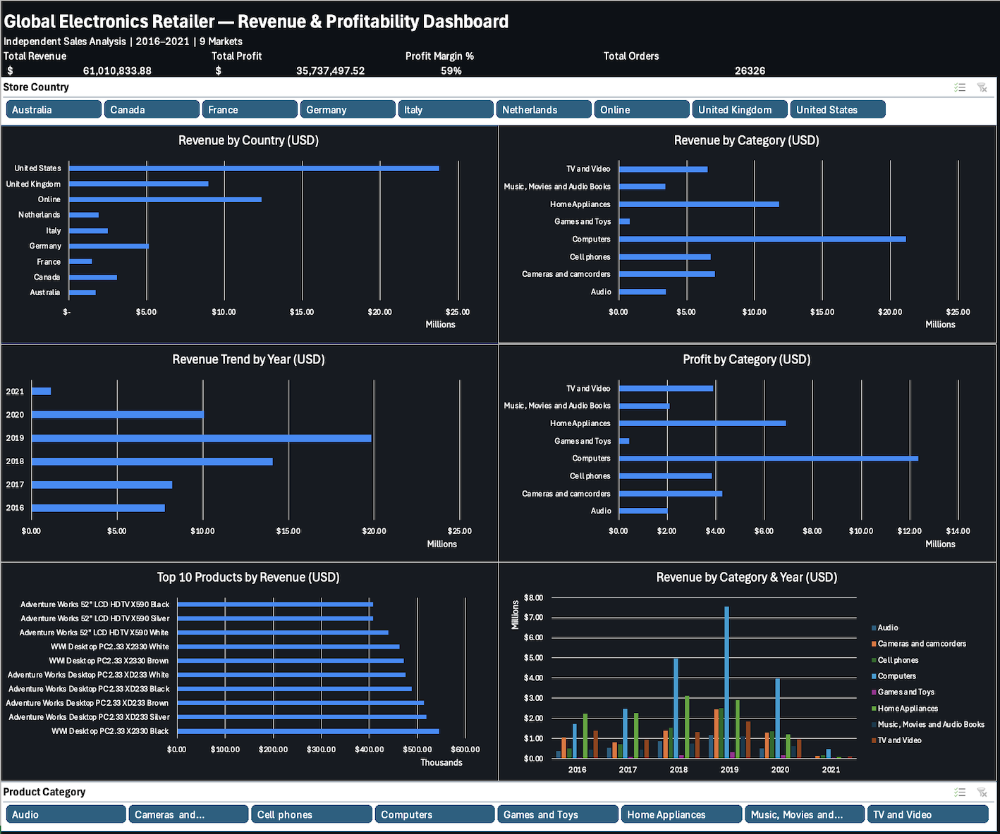
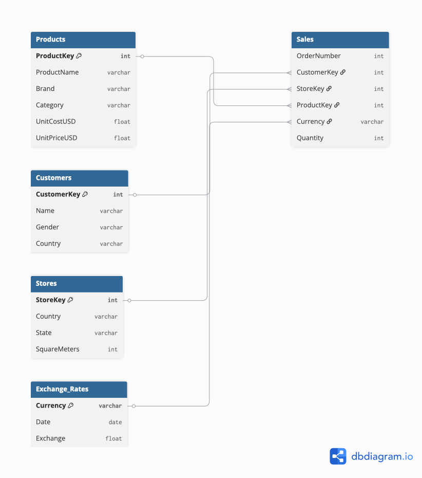

# Global Electronics Retailer — Revenue & Profitability Dashboard

## Project Overview

This analysis examines three years of transactional data across a global electronics retailer operating in 9 markets including an online channel. The goal was to identify which markets, product categories, and customer segments drive the most revenue and profit — and where the business has room to grow.

**Tool:** Microsoft Excel
**Dataset:** Maven Analytics — Global Electronics Retailer
**Scope:** 26,236 orders across 9 markets | 2016–2021
**Total Revenue Analyzed:** $61,010,833.88 USD

---

## Dashboard Preview

---

## Data Structure

The dataset follows a star schema with 5 tables:

| Table | Description |
|---|---|
| Sales | Fact table — order transactions with quantity, currency, and keys |
| Products | Product name, brand, category, unit cost, unit price |
| Customers | Demographics, location, gender, birthday |
| Stores | Country, state, store size (sq meters), open date |
| Exchange Rates | Daily currency rates (CAD, AUD, EUR, GBP) vs USD |

All revenue and profit figures were normalized to USD using daily exchange rates via XLOOKUP across the Sales and Exchange Rates tables.

---

## Key Findings

- **The United States dominates revenue at $23.8M — nearly 39% of total global revenue.** The next closest physical market is the United Kingdom at $9M, less than half of the US figure. This concentration creates meaningful risk if US demand softens.

- **Computers drive both the highest revenue ($21.1M) and highest profit ($12.3M) of any category.** Games and Toys, by contrast, generated only $791K in revenue with $434K in profit — the weakest category by both metrics. The retailer is fundamentally a computer and home appliance business, not a diversified electronics retailer.

- **Revenue grew consistently from $7.8M in 2016 to a peak of $19.8M in 2019 — a 154% increase over three years.** Growth collapsed in 2020 to $10.1M, a 49% drop almost certainly driven by COVID-19 disruption to physical store traffic. The 2021 figure of $1.1M represents a partial year and should not be interpreted as continued decline.

- **Online sales generated $12.4M — making it the second largest "market" behind only the United States.** This is a significant signal. The online channel outperformed every physical country market except the US, suggesting the retailer has an opportunity to further invest in e-commerce infrastructure.

- **Overall profit margin sits at 59%, indicating strong unit economics.** The business retains nearly 60 cents of every dollar in revenue after cost of goods. Home Appliances ($11.8M profit) and Computers ($12.3M profit) are the two categories sustaining this margin.

---

## Methodology

**Revenue Calculation:**
`Revenue USD = Quantity × Unit Price USD ÷ Exchange Rate`

**Profit Calculation:**
`Profit USD = Quantity × (Unit Price USD − Unit Cost USD) ÷ Exchange Rate`

Exchange rates were matched to each transaction by currency code using XLOOKUP against the Exchange Rates table. All figures are normalized to USD for cross-market comparability.

**Helper columns added to Sales table:**
- `Revenue USD` — normalized transaction revenue
- `Profit USD` — normalized transaction profit
- `Store Country` — pulled from Stores via StoreKey
- `Product Category` — pulled from Products via ProductKey
- `Product Name` — pulled from Products via ProductKey

---

## Dashboard Features

- 6 interactive pivot charts (Revenue by Country, Revenue by Category, Revenue Trend by Year, Profit by Category, Top 10 Products by Revenue, Revenue by Category & Year)
- 4 KPI cards (Total Revenue, Total Profit, Profit Margin %, Total Orders)
- 2 slicers (Store Country, Product Category) connected to all 6 charts simultaneously
- Dark near-black theme with consistent color palette throughout

---

## Skills Demonstrated

- Multi-table data modeling (star schema)
- XLOOKUP across multiple tables for dynamic column enrichment
- Currency normalization using daily exchange rates
- Pivot table construction and configuration
- Interactive dashboard design with connected slicers
- Consulting-style analytical narrative

---

## Data Source

Maven Analytics Data Playground — [Global Electronics Retailer](https://mavenanalytics.io/data-playground/global-electronics-retailer)

---

## Contact

**Dylan Villanueva**
dvillanueva227@outlook.com
[GitHub Portfolio](https://dvillanueva227.github.io)
